# Chapter 05: Network Attacks and Secure Network Protocols

## Abstract

This chapter covers network attacks and the secure protocols designed to defeat them. The chapter describes denial-of-service and distributed denial-of-service attacks, attacks against the Domain Name System, and data link layer attacks such as ARP poisoning, MAC flooding, and MAC cloning. The chapter then examines on-path attacks, the Man-In-The-Middle and the Man-In-The-Browser. The chapter closes with the secure versions of common network protocols: POP3S, IMAPS, S/MIME, SSH, FTPS, SFTP, SRTP, LDAPS, HTTPS, DNS over HTTPS, SNMPv3, and IPSec, plus additional protections such as SMTPS with STARTTLS, DNS over TLS, Network Time Security, and syslog over TLS.

## Objectives

- Define denial-of-service and distributed denial-of-service attacks, describe the three DDoS attack types, explain the vulnerability of operational technology, and describe the amplified and reflected DDoS attack methods and the four DDoS mitigation techniques.
- Describe the Domain Name System, DNS resolution, DNS zones, authoritative name servers, and domain reputation, then explain domain hijacking, URL redirection, DNS poisoning, and the protection DNSSEC provides.
- Describe the data link layer, MAC addresses, and the address resolution protocol, then explain ARP poisoning, MAC flooding, and MAC cloning.
- Compare the Man-In-The-Middle and Man-In-The-Browser attacks and explain how a secure channel prevents an on-path attack.
- Compare POP3 and POP3S with IMAP4 and IMAPS, and describe the security services S/MIME provides for email.
- Describe the Secure Shell protocol and compare the FTPS and SFTP file transfer protocols.
- Describe SRTP for voice and video, LDAPS for directory services, HTTPS for web traffic, and DNS over HTTPS for private DNS resolution.
- Describe the components of SNMP, the three SNMPv3 security levels, and network device hardening practices.
- Describe the IPSec protocol suite, the AH and ESP protocols, and the transport and tunnel modes.
- Describe additional secure protocols: SMTPS and STARTTLS for email sending, DNS over TLS, Network Time Security, and syslog over TLS.

## Content

### 1. Attacks: DDoS, DNS Poisoning, and Domain Hijacking: Denial-of-Service Attacks

A denial-of-service (DoS) attack is an attack against a network resource that aims to prevent, disrupt, or delay authorized users from accessing the resource. A distributed denial-of-service (DDoS) attack is a DoS attack launched simultaneously from multiple systems. The many attacking systems produce more traffic than one system can generate and make the attack harder to block, because the target cannot filter a single source address.

Three types of DDoS attacks exist:

- **Network-based DDoS attack:** a DDoS attack that exhausts the target system's network bandwidth. Also called a volume-based DDoS attack. UDP floods and ICMP floods are network-based DDoS attacks.
- **Protocol-based DDoS attack:** a DDoS attack that exhausts the network resources of the target system or of network infrastructure equipment, such as a firewall or a load balancer. Also called a state exhaustion DDoS attack. A protocol-based attack exploits weaknesses in network layer (OSI layer 3) and transport layer (OSI layer 4) protocols to create maliciously configured protocol packets. A TCP SYN flood is a protocol-based DDoS attack.
- **Application layer DDoS attack:** a DDoS attack that exhausts specific functions or features of a program. Also called an OSI layer 7 DDoS attack. A DDoS attack that floods an Internet web server with HTTP requests is an application layer attack.

| Type | Also known as | Exhausts | Example |
| --- | --- | --- | --- |
| Network-based | Volume-based | Network bandwidth | UDP flood, ICMP flood |
| Protocol-based | State exhaustion | System or infrastructure resources | TCP SYN flood |
| Application layer | Layer 7 | Program functions or features | HTTP request flood |

A DDoS attack may target operational technology (OT). Operational technology is the set of hardware devices and software programs that monitor and control industrial equipment. For example, industrial control systems (ICS) use OT to monitor and control power plants and manufacturing processes. OT is particularly vulnerable to DDoS attacks because OT often runs legacy hardware and software. OT devices have limited resources and capabilities, and operators are less likely to have secured the devices against modern attacks.

#### **DDoS Attack Methods**

A DDoS attack disrupts service availability by overwhelming network components through the exploitation of vulnerabilities in a protocol or an application layer. For example, IP lacks source IP address verification, so an attacker can use spoofed IP addresses to launch a DDoS attack. Two DDoS attack methods exist:

- **Amplified DDoS attack:** a DDoS attack method that exploits the response mechanism of certain protocols to amplify the traffic volume directed at a target. In a DNS amplification attack, the attacker requests all records associated with a domain from multiple public DNS servers, using the target's IP address as the source address. Every DNS server then sends a large DNS response to the target, and the combined responses flood the target. The request is small and the response is large, so the attacker multiplies the attack traffic without spending the attacker's own bandwidth.
- **Reflected DDoS attack:** a DDoS attack method that exploits the response mechanism of certain protocols to redirect traffic from third-party services toward a target. In a reflected UDP flood attack, the attacker sends spoofed UDP requests to multiple public UDP services, using the target's IP address as the source address. Each UDP service sends the response to the target, flooding the target with UDP responses from servers the target never contacted.

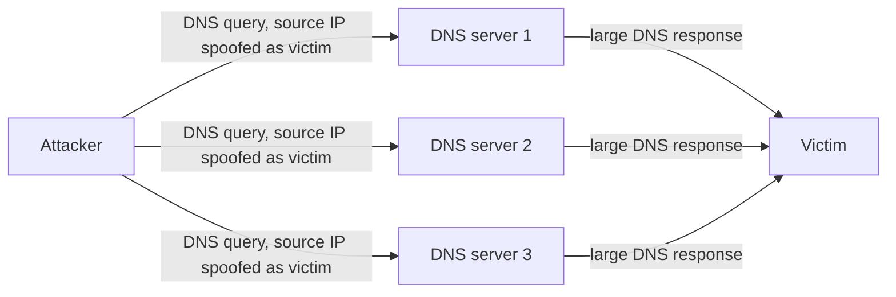

The two methods combine in practice: an amplified attack is also reflected when the attacker spoofs the victim's address, because the amplifying server reflects the response toward the victim.

A TCP SYN flood illustrates the protocol-based type. The attacker sends SYN packets with spoofed source addresses, and the target allocates a half-open connection for each SYN and replies to addresses that never answer. The target's connection table fills with half-open connections until no capacity remains for legitimate users.

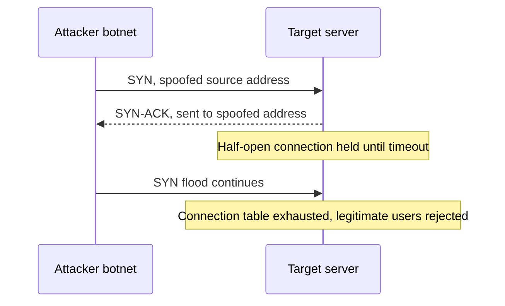

Two incidents show the scale of real DDoS attacks. In October 2016, the Mirai botnet, built from hundreds of thousands of compromised Internet of Things devices, attacked the DNS provider **Dyn** and disrupted access to **Twitter**, **Netflix**, and **Reddit** for much of a day. In February 2018, a memcached amplification attack against **GitHub** peaked at 1.35 terabits per second, the largest DDoS attack publicly reported at that time.

#### **DDoS Mitigation**

Defenses against DDoS attacks filter or absorb attack traffic before the traffic reaches the target. Four common mitigation techniques exist:

- **Rate limiting:** a cap on the number of requests a server accepts from one source in a time window. Rate limiting stops simple floods from a single source but struggles against distributed attacks where thousands of sources each send a small share of the traffic.
- **Black hole filtering:** a route that discards all traffic destined for the target, attack traffic and legitimate traffic alike. Black hole filtering protects the rest of the network but takes the target offline, completing the attacker's goal.
- **Anycast distribution:** an announcement of the same IP address from many locations, so attack traffic spreads across the whole network instead of concentrating on one point.
- **Traffic scrubbing:** a service that receives the target's traffic, discards attack packets, and forwards only clean traffic to the target.

For example, **GitHub** mitigated the February 2018 memcached attack by routing traffic through **Akamai**'s Prolexic scrubbing service, and normal access returned within about 10 minutes.

Network infrastructure devices support these techniques. A load balancer distributes requests across many servers, which absorbs application layer floods, but a state exhaustion attack can target the load balancer's own connection table. A firewall with access control lists blocks traffic from known malicious sources and drops malformed protocol packets, and SYN cookies let a server answer a SYN flood without allocating a half-open connection for each request. An intrusion prevention system (IPS) can detect flood patterns and trigger filtering rules without human intervention. These devices have finite resources of their own, which is why protocol-based attacks target firewalls and load balancers directly.

### 2. Attacks: Domain Hijacking, URL Redirection, and DNS Poisoning

**The domain name system (DNS)** is a hierarchical and decentralized naming system for identifying and locating the resources connected to a network. Every network resource has a domain name and an IP address. DNS resolution, also called DNS lookup or DNS query, is the process of translating a domain name into an IP address. A DNS nameserver, or simply a DNS server, performs DNS resolution. For example, a DNS server resolves the domain *google.com* to the IP address 216.58.210.206.

A DNS resolution walks the hierarchy from the root down to the authoritative server. The client's recursive resolver asks the root nameserver, follows the referral to the .com nameserver, follows the next referral to the authoritative server, and caches the answer for future queries.

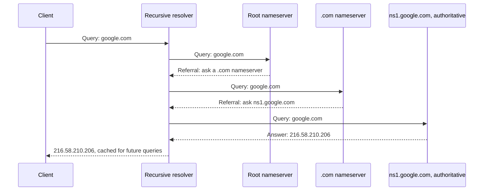

DNS is broken up into different zones. A DNS zone is a portion of the DNS namespace managed by an administrator or a specific organization. An authoritative name server is a DNS server that manages a domain's configuration, also known as the domain's DNS record. For example, *ns1.google.com* is an authoritative name server for the domain *google.com*.

The hierarchy delegates management at every level, which makes DNS decentralized: no single organization operates the whole namespace. The root zone delegates each top-level domain to a registry, and each registry delegates each domain to the domain's owner.

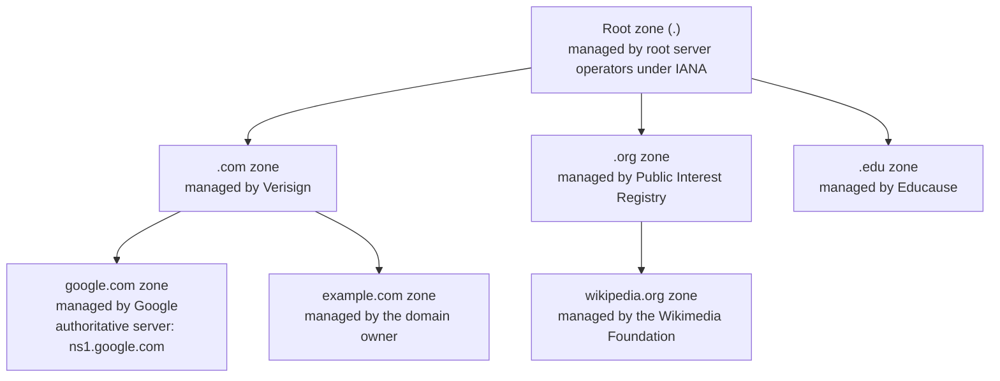

**Domain reputation** is a measure of a domain's trustworthiness based on historical data about the domain. Email service providers use domain reputation scores to adjust the priority of email delivery. A domain associated with spam email receives a low reputation score, and a service provider may reduce the delivery priority of email originating from that domain. For example, reputation services such as **Spamhaus** and **Google Safe Browsing** track domain behavior: a domain listed for sending spam can find the domain's email routed to junk folders or rejected, while a domain with years of clean history earns faster delivery. A newly registered domain carries no reputation history, which is one reason phishing campaigns rotate through fresh domains.

#### **DNS Attacks**

Domain hijacking is the act of changing a domain's registration information without the knowledge or consent of the domain owner. An attacker can perform domain hijacking through technical means, such as exploiting a vulnerability in a DNS host system. An attacker can also use non-technical means: a social engineering attack can trick a registrar into modifying a domain's registration information or fraudulently transferring domain ownership to a third party.

URL redirection is the act of using a URL to divert a user to a malicious website. One method sends the potential victim a phishing email containing a link to the malicious website. Another method abuses the system's hosts file. A hosts file resolves a domain name to an IP address before the system queries a DNS server, so an attacker who modifies the hosts file can map a legitimate domain name to the IP address of a malicious website. For example, adding the line `198.51.100.77 www.example-bank.com` to a hosts file directs every visit to the banking domain to the attacker's server at 198.51.100.77, even though DNS still resolves the correct address.

DNS poisoning, also called DNS cache poisoning or DNS spoofing, is an attack that redirects a user to a malicious website by modifying the user's DNS query results. In a DNS poisoning attack, the attacker replaces an IP address in a DNS record with the IP address of a computer under the attacker's control. An attacker can perform DNS poisoning through several methods:

- **Malware:** install malware on the user's computer that alters DNS settings.
- **Message modification:** modify a DNS message in transit between the client and the server.
- **Router settings:** modify the DNS server settings on a router.
- **Server records:** modify the DNS records on a DNS server.

A DNS poisoning attack can form part of a phishing attack. The poisoned DNS query redirects the user to a spoofed website that resembles the website the user intended to access, and the spoofed website collects information from the user, such as the user's credentials.

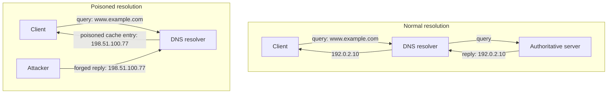

#### **DNSSEC**

Domain Name System Security Extensions, also called DNS Security Extensions or DNSSEC, is a set of extensions to DNS that gives a DNS resolver cryptographic authentication of DNS data through digital signatures. DNSSEC assigns every DNS zone a public-private key pair. The zone owner uses the zone's private key to digitally sign the DNS data in the zone. A DNS resolver uses the zone's public key to validate the authenticity of the DNS data. When the resolver validates the digital signature, the resolver returns the DNS data to the client. When the resolver cannot validate the signature, the resolver discards the DNS data and returns an error to the DNS client.

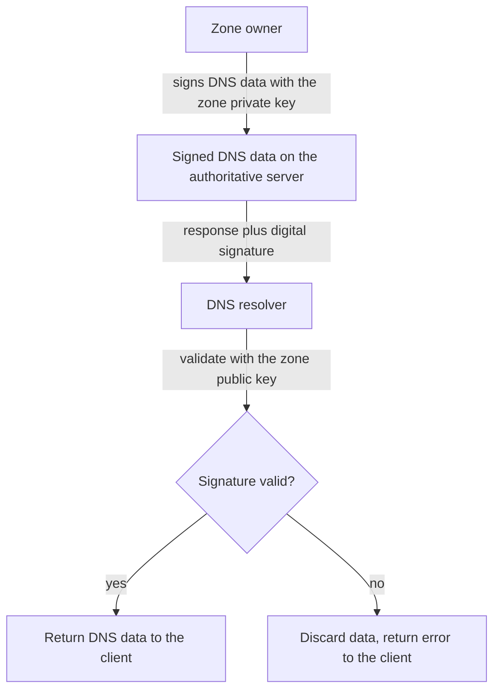

Digital signatures improve DNS security in two ways:

- **Data origin authentication:** the DNS client is assured that the DNS data originated from the zone owner.
- **Data integrity:** the DNS client is assured that the DNS data was not modified in transit.

DNSSEC protects a DNS client from using malicious DNS data and prevents a man-in-the-middle attack by ensuring that DNS data is not forged or modified in transit. For example, in a DNS cache poisoning attack, an attacker modifies DNS data so a domain name resolves to the IP address of a malicious website. DNSSEC gives the DNS client assurance that the received DNS data is identical to the data the zone owner published and the authoritative DNS server served, so the forged record fails validation.

### 3. Attacks: ARP Poisoning, MAC Flooding, and MAC Cloning

#### **The Data Link Layer**

The data link layer is the second layer of the seven-layer Open System Interconnection (OSI) model. The data link layer, or Layer 2, moves data between two connected devices on the same network, provides flow control, and detects and corrects errors that occur in the physical layer (Layer 1). Ethernet is a Layer 2 protocol.

Every network device has a media access control address at the data link layer. A media access control address, or MAC address, is a unique 48-bit identifier assigned to a network device. A MAC address appears as six groups of two hexadecimal digits separated by hyphens or colons. For example, `DA-C4-97-C3-3E-DE` and `2C:54:91:87:C9:E2` are MAC addresses.

The address resolution protocol (ARP) resolves an Internet address (Layer 3) into a MAC address (Layer 2). An ARP cache table, or ARP cache, maps an Internet address to the corresponding MAC address. To deliver a data packet, a device consults the ARP cache to find the MAC address that maps to the packet's destination IP address.

#### **Data Link Layer Attacks**

Three types of attacks target the data link layer:

- **ARP poisoning:** an attack in which the attacker sends spoofed ARP messages on a local area network (LAN) to associate the attacker's MAC address with the IP address of a target host on the LAN. Also called ARP cache poisoning or ARP spoofing. ARP lacks authentication, so any device on a LAN can send an ARP message. The attacker can launch ARP poisoning from a compromised host on the LAN or from an attacker's device connected to the LAN. ARP poisoning causes other hosts to send the target's traffic to the attacker, so the attacker receives all data packets destined for the target host.
- **MAC flooding:** an attack that sends a large number of invalid MAC addresses to a network switch, aiming to overwrite the switch's MAC table. A MAC table maps each network device's MAC address to a physical port on the switch. A MAC table has limited storage capacity, so a MAC flooding attack forces the switch to overwrite legitimate MAC table entries with invalid addresses. When the switch receives a packet whose destination MAC address is absent from the MAC table, the switch performs unicast flooding: the switch broadcasts the packet on all ports. Unicast flooding gives the attacker access to all data packets on the LAN.
- **MAC cloning:** the act of changing the factory-assigned MAC address of a network device. Also called MAC spoofing. A software program can change a MAC address without any hardware modification. MAC cloning lets an attacker bypass a MAC address-based restricted network or authentication system and hide a rogue device on a network.

Two examples show how these attacks work. For MAC cloning, consider a campus network that admits only registered MAC addresses: the attacker's laptop is unknown to the network, but after the attacker clones the MAC address of a registered printer, the access control system admits the laptop as if the laptop were the printer. For MAC flooding, consider a switch whose MAC table holds 8,000 entries: once the attacker fills all 8,000 entries with fake addresses, the switch floods every new frame to every port, and the attacker's connected device receives traffic addressed to other hosts.

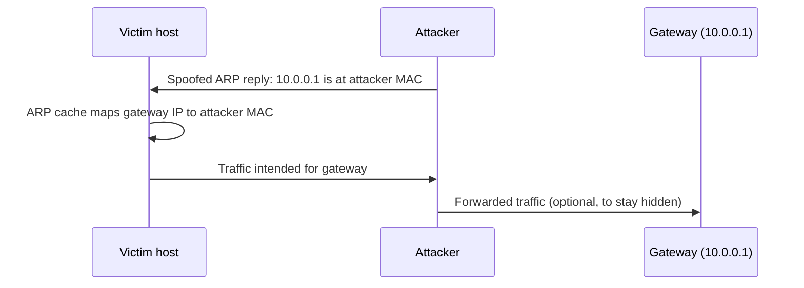

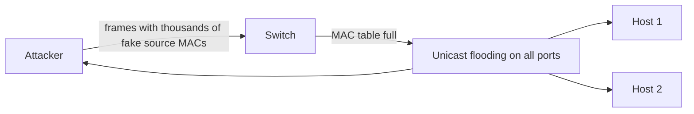

### 4. Attacks: On-Path Man-In-The-Middle and Man-In-The-Browser

A Man-In-The-Middle (MITM) attack is an attack in which an attacker eavesdrops on or modifies the communications between two parties. A MITM attack operates at the network layer (Layer 3). Both parties communicate with the attacker, yet each party believes the communication flows directly to the other party. For example, a DNS poisoning attack that redirects a user to a malicious website by modifying the user's DNS query is a MITM attack.

In a typical MITM attack, the attacker intercepts a message in transit, modifies the message, and sends the modified message to the recipient. The attacker can impersonate one or both of the communicating parties. Data communication over a secure channel prevents a MITM attack. A secure channel is a communication channel that guarantees data authenticity and data confidentiality.

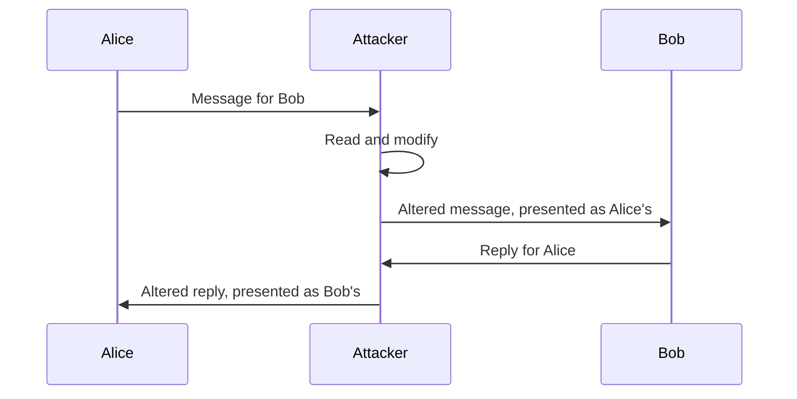

A Man-In-The-Browser (MITB) attack is a type of MITM attack that uses malware to intercept or modify messages exchanged between a web browser and a web server. A MITB attack operates at the application layer (Layer 7). Attackers most often use MITB to steal financial information by modifying a user's communications with an Internet banking website.

In a MITB attack, a Trojan horse exploits a web browser vulnerability through a browser extension or a user script. The extension activates when the user visits a targeted website. The extension modifies the user's input on a specific HTML form before the browser sends the form data to the targeted website. The extension also selectively modifies data returned from the targeted website before presenting the data to the user. For example, the extension can change the destination account number on a funds transfer form, then rewrite the confirmation page so the user sees the original account number.

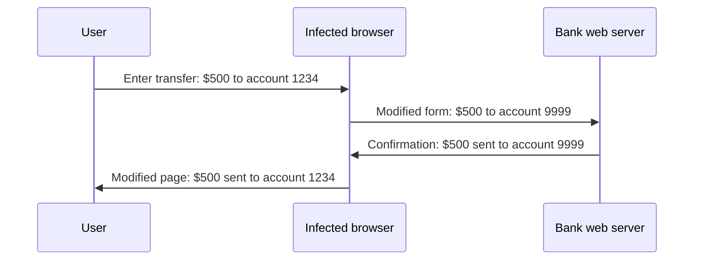

A MITB attack is difficult to remove because the malware is embedded in an extension and may evade anti-malware software. The infected extension provides added browser functionality and activates only when the user visits a targeted website, so the malware can remain undetected on a system for an extended period.

Banking Trojan families such as Zeus used MITB techniques in real attacks: the Trojan's web injects altered online banking pages, captured credentials, and modified transfer details, while the browser continued to display the transaction the user expected.

### 5. Protocols for Email: POP3S, IMAPS, and S/MIME

#### **POP3 and POP3S**

Post office protocol (POP) is an Internet standard protocol that an email client uses to retrieve email from a mail server. POP does not support sending email. POP3, or POP version 3, is the latest version of POP. POP is an application layer protocol (Layer 7) and uses TCP port 110.

A POP server creates a mailbox or folder for each email account. When the POP server receives an email, the server saves the email to the recipient's mailbox. The account owner uses a POP client, such as **Microsoft** Outlook, to connect to the POP server and download the email. By default, the POP server removes an email after the POP client downloads the email.

POP is not a secure protocol because POP transmits data in cleartext. POP secure, also called POPS or POP3S, uses SSL/TLS to secure communications between a POP client and a POP server. POP3S provides data privacy and integrity and uses TCP port 995.

#### **IMAP4 and IMAPS**

Internet message access protocol (IMAP) is an Internet standard protocol that an email client uses to retrieve email from a mail server. IMAP4, or IMAP version 4, is the latest version of IMAP. IMAP is an application layer protocol (Layer 7) and uses TCP port 143.

IMAP allows multiple email clients to manage one mailbox. By default, an email remains on the IMAP server after an IMAP client downloads the email, and the server removes the email only when the user explicitly deletes the email on the server. This behavior makes IMAP the better choice for a user who reads email from a phone, a laptop, and a desktop, because every client sees the same mailbox state.

IMAP is not a secure protocol because IMAP transmits data in cleartext. IMAP secure, or IMAPS, uses SSL/TLS to secure communications between an IMAP client and an IMAP server. IMAPS provides data privacy and integrity and uses TCP port 993.

| Property | POP3 | POP3S | IMAP4 | IMAPS |
| --- | --- | --- | --- | --- |
| Default port | TCP 110 | TCP 995 | TCP 143 | TCP 993 |
| Encryption | None | SSL/TLS | None | SSL/TLS |
| Server copy after download | Deleted by default | Deleted by default | Kept until user deletes | Kept until user deletes |
| Multi-client mailbox management | No | No | Yes | Yes |

#### **S/MIME**

Multipurpose Internet Mail Extensions (MIME) is an Internet standard that extends the format of an email message to support non-ASCII character sets and multimedia attachments. Secure/Multipurpose Internet Mail Extensions (S/MIME) is an Internet standard for signing and encrypting MIME data. S/MIME provides four security services for electronic messaging applications: authentication, integrity, non-repudiation of origin, and confidentiality.

S/MIME requires an X.509 certificate for each email client. S/MIME can use the RSA, DSA, and ECDSA digital signature algorithms for message signing, and the AES and 3DES ciphers for message encryption. S/MIME is a widely accepted protocol for sending a digitally signed and encrypted message, and most email service providers support the protocol. The complexities of certificate management and validation have prevented widespread adoption of S/MIME.

For example, when Alice sends an S/MIME message to Bob, Alice's email client signs the message with Alice's private key and encrypts the message with Bob's public key, both drawn from X.509 certificates. Bob's email client verifies the signature with Alice's public key and decrypts the message with Bob's private key. A tampered message fails signature verification, and an eavesdropper without Bob's private key cannot read the content.

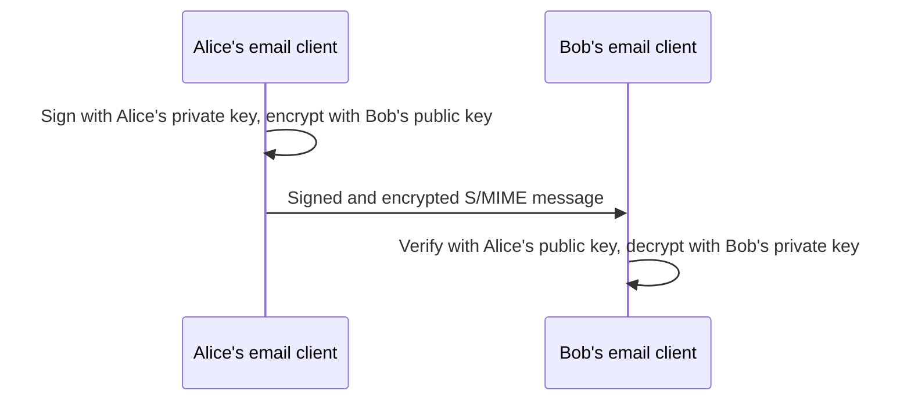

### 6. Protocols for Remote Access and File Transfer: SSH, FTPS, and SFTP

#### **SSH**

Secure shell protocol (SSH) is a cryptographic network protocol for securely operating a network service over an insecure network. SSH provides a secure channel by connecting an SSH client to an SSH server in a client-server model. Designers created SSH as a replacement for Telnet and for unsecured remote shell protocols that send information, including passwords, in plaintext. SSH uses TCP port 22 by default.

SSH provides data confidentiality through encryption and data integrity through message authentication codes (MAC). SSH supports protocol tunneling, the encapsulation of one protocol's packets within the packets of another protocol, so any network service can be secured with SSH. The SSH file transfer protocol (SFTP) and the secure copy protocol (SCP) both use SSH.

SSH can provide public key authentication to grant access without requiring a user password for each login. The SSH authentication protocol enables automated, passwordless logins and single sign-on (SSO). In SSH public key authentication, the SSH server stores the user's public key, and the user authenticates with the user's private key. For example, an administrator manages a remote Linux web server over SSH on TCP port 22, and an automated deployment script logs in with a private key stored on the build server, so no password prompt can block the unattended run.

#### **FTPS and SFTP**

FTPS, also called FTP over SSL or FTP Secure, is an extension to the file transfer protocol (FTP) that uses SSL/TLS to provide communication security. FTPS supports all SSL/TLS cryptographic protocols, including client and server certificates for authentication, AES and 3DES ciphers for encryption, and SHA1 and MD5 hash functions for data integrity. FTPS supports X.509 self-signed or trusted public key certificates. FTPS uses TCP port 989 for the data channel and TCP port 990 for the control channel.

SSH file transfer protocol (SFTP), also called SSH-FTP or Secure FTP, is an extension of the SSH protocol that enables secure file transfer between networked hosts. SFTP provides remote file system management: an application can list the contents of a remote directory, delete a remote file, and resume an interrupted file transfer. SFTP uses TCP port 22.

| Property | FTPS | SFTP |
| --- | --- | --- |
| Based on | FTP | SSH |
| Security | SSL/TLS | SSH |
| Ports | TCP 989 (data), TCP 990 (control) | TCP 22 |
| Authentication | X.509 certificates | SSH keys |
| Remote file management | No | Yes: list, delete, resume |

SSH protocol tunneling wraps any cleartext protocol inside the encrypted SSH channel:

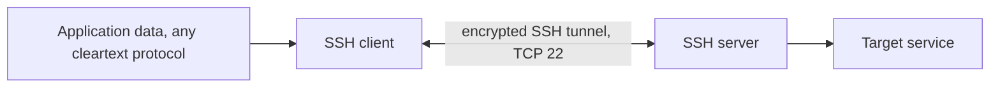

### 7. Protocols for Voice and Video, Directory Services, and the Web: SRTP, LDAPS, and HTTPS

#### **SRTP**

Secure real-time transport protocol (SRTP) is a protocol for secure delivery of voice and video services over an IP network. SRTP extends the real-time transport protocol (RTP). Voice over Internet Protocol (VoIP), video teleconferencing applications, streaming video, and devices with push-to-talk functionality all use SRTP. SRTP provides confidentiality, authentication, and integrity for data in unicast (one to one) and multicast (one to many) applications. SRTP uses the advanced encryption standard (AES) in counter mode for encryption and HMAC-SHA1, the default integrity algorithm defined in RFC 3711, for data integrity and authenticity.

SRTP defends against a replay attack through a sequence number on each packet. The receiver records the sequence number of every previously received packet and accepts a new packet only if the packet has not been received before. SRTP uses UDP port 5004 by default. For example, if an attacker captures an SRTP packet from a VoIP call and retransmits the packet, the receiver discards the copy because the packet's sequence number was already received, so the replayed audio never reaches the call participant.

#### **LDAPS**

Lightweight directory access protocol (LDAP) is a protocol for accessing and maintaining distributed directory information services over an IP network. A directory service shares information about a user, system, service, or application in a network. LDAP commonly provides a central location for storing usernames and passwords, and different applications and services use LDAP to validate a user. For example, Active Directory in Windows Server 2019 uses LDAP.

LDAP traffic is not secure because LDAP transmits data in cleartext. LDAPS, also called LDAP Secure or LDAP over SSL, uses SSL/TLS to protect LDAP transmissions. In LDAPS, the client and the server establish an SSL/TLS connection before transmitting any LDAP message, and the LDAPS connection closes when the underlying SSL/TLS connection terminates. LDAPS uses TCP port 636 by default.

Applications that use LDAP might be vulnerable to LDAP injection attacks. An LDAP injection attack is an attack in which the attacker exploits input validation vulnerabilities to construct and execute an unauthorized LDAP query. An LDAP injection attack can modify LDAP content or grant permissions to an unauthorized query.

For example, when a user signs in to a corporate application, the application validates the credentials against Active Directory over LDAPS on TCP 636, so the password never crosses the network in cleartext.

LDAPS protects credentials in transit, but encryption does nothing against LDAP injection, because the malicious input travels inside the encrypted channel and the flaw lives in the application's input handling. A typical vulnerable application builds an authentication filter by inserting the login form fields into a template:

```text
(&(uid=USERNAME)(userPassword=PASSWORD))
```

The `&` operator requires both conditions to hold: the entry's `uid` must equal the typed username, and the password must match. When the attacker types `*)(uid=*))(|(uid=*` as the username with any password, such as `x`, the template becomes:

```text
(&(uid=*)(uid=*))(|(uid=*)(userPassword=x))
```

Three effects change the filter's logic:

- **Wildcard match:** `uid=*` matches any entry that has a `uid` attribute, which is effectively every user in the directory.
- **Early termination:** the extra closing parentheses end the `&` clause after the two wildcard conditions, so `(&(uid=*)(uid=*))` evaluates to true for any user.
- **Bypassed password check:** the remaining `(|(uid=*)(userPassword=x))` is leftover OR logic that the server ignores or evaluates loosely, so the password never gates the result.

The directory returns the first matching entry, often an administrator account, and the application treats the attacker as authenticated without a valid password. The fix is to validate and escape all input before placing the input in a filter, following the escaping rules in RFC 4515, where characters such as `*`, `(`, `)`, and `\` must be escaped, or to use parameterized LDAP APIs that never let input alter the filter structure.

#### **HTTPS**

Hypertext transfer protocol secure (HTTPS), also called HTTP over SSL or HTTP over TLS, is an extension of the hypertext transfer protocol (HTTP) that uses SSL/TLS to establish an authenticated and encrypted connection between a client and a server. HTTPS secures data exchange between a web browser and a web server. HTTPS is an application layer protocol (Layer 7) and uses TCP port 443 by default.

HTTPS relies on the cryptographic services of the SSL/TLS protocol to secure HTTP data. SSL/TLS uses digital certificates for authentication, encryption for data confidentiality, and message authentication codes (MACs) for data integrity. HTTPS supports mutual authentication, in which both the client and the server authenticate each other. HTTPS protects against a man-in-the-middle attack and against the eavesdropping and tampering of data exchanged between a web browser and a web server.

For example, when a user opens a banking site over HTTPS, the browser validates the server's X.509 certificate before any account data crosses the network, and a MITM attacker on the path cannot read or alter the session without a trusted certificate.

```mermaid
sequenceDiagram
    participant W as Web browser
    participant S as Web server
    W->>S: Connect to TCP 443
    S->>W: Server X.509 certificate
    W->>W: Validate certificate chain
    W<->>S: TLS handshake, session keys established
    W<->>S: Encrypted HTTP requests and responses
```

#### **DNS over HTTPS (DoH)**

Standard DNS resolution sends queries in cleartext over UDP or TCP port 53, so any on-path observer can read or modify the queries even when DNSSEC validates the answers. DNS over HTTPS (DoH), defined in RFC 8484, sends DNS queries inside HTTPS connections over TCP 443. DoH encrypts the query and the response between the client and the resolver, and the DNS traffic blends into ordinary web traffic because both share port 443.

DoH and DNSSEC solve different problems and work together. DNSSEC authenticates DNS data through digital signatures but does not encrypt the data. DoH encrypts the channel between the client and the resolver but does not verify that the data came from the zone owner. For example, **Mozilla** enabled DoH by default in Firefox for users in the United States in February 2020, using **Cloudflare**'s 1.1.1.1 resolver.

Several public DoH resolvers publish strong security and privacy policies:

| Name | Address | Website | DoH endpoint | Location |
| --- | --- | --- | --- | --- |
| **Cloudflare** | `1.1.1.1`, `1.0.0.1` | cloudflare.com | `https://cloudflare-dns.com/dns-query` | United States |
| **Quad9** | `9.9.9.9` | quad9.net | `https://dns.quad9.net/dns-query` | Switzerland |
| **Google Public DNS** | `8.8.8.8`, `8.8.4.4` | dns.google | `https://dns.google/dns-query` | United States |
| **Mullvad** | `194.242.2.2` | mullvad.net | `https://dns.mullvad.net/dns-query` | Sweden |
| **AdGuard DNS** | `94.140.14.14` | adguard-dns.io | `https://dns.adguard-dns.com/dns-query` | Cyprus |

The resolvers differ in their security and privacy properties. **Cloudflare** deletes or anonymizes query source IP addresses within 25 hours and commissions an annual privacy audit by a Big Four accounting firm. **Quad9**, a nonprofit, blocks known malicious domains through threat intelligence feeds and does not record user IP addresses. **Mullvad** keeps no logs, and **AdGuard DNS** blocks advertising and tracking domains at the resolver. Note that **Mullvad** has announced the shutdown of the public resolver on November 2, 2026, and recommends **Quad9** as a replacement.

A user selects a resolver in the browser or operating system. Firefox ships with **Cloudflare** as the default DoH provider in the United States and offers **NextDNS** as an alternative.

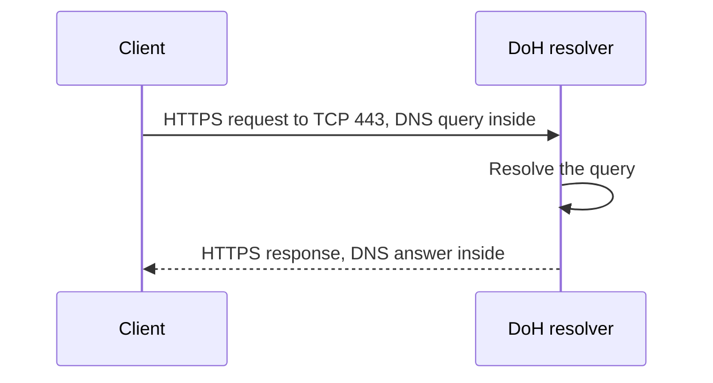

### 8. Protocols for Network Management: SNMPv3

#### **SNMP Components**

Simple network management protocol (SNMP) is a network protocol for monitoring and managing networked devices in an IP network. SNMP is an application layer protocol (Layer 7) and uses UDP ports 161 and 162.

- **Managed device:** a network node that implements an SNMP interface allowing access to the node's information. Also called a network element. A managed device can be any type of device, including a switch, router, cable modem, printer, IP telephone, or computer host.
- **SNMP manager:** a system that monitors and controls a network element's activities through SNMP.
- **SNMP agent:** the software that runs on a network element and collects and maintains information about the element.
- **SNMP trap:** an alert message sent from an SNMP agent to an SNMP manager to notify the manager of an event at a network element.

An SNMP manager can request information from a network element or set a configuration parameter on the element. An SNMP agent listens for and executes the SNMP commands the manager sends.

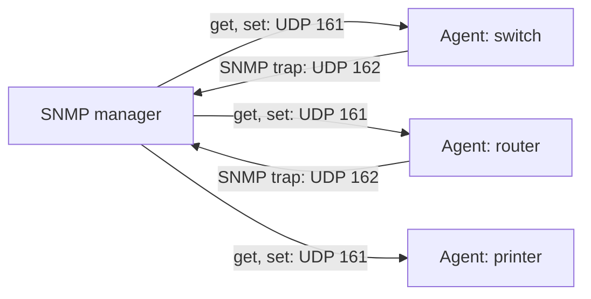

#### **SNMP Security**

SNMPv3 is the latest version of SNMP and improves security over the previous versions. SNMPv3 supports authentication, encryption, and integrity of an SNMP message. Three security levels exist in SNMPv3:

- **NoAuthNoPriv:** No Authentication and No Privacy. The SNMP message is not authenticated and not encrypted. NoAuthNoPriv should be used only in a closed, secure network.
- **AuthNoPriv:** Authentication and No Privacy. The SNMP message must be authenticated during transmission, but the message is not encrypted. SNMPv3 supports HMAC-MD5 and HMAC-SHA for authentication and integrity.
- **AuthPriv:** Authentication and Privacy. The SNMP message must be authenticated and encrypted during transmission. SNMPv3 supports HMAC-MD5 and HMAC-SHA for authentication and integrity, and DES for privacy. RFC 3414 defines CBC-DES as the mandatory privacy protocol, and RFC 3826 adds AES as a stronger option that most modern deployments prefer.

| Security level | Authentication | Encryption | Algorithms |
| --- | --- | --- | --- |
| NoAuthNoPriv | No | No | None |
| AuthNoPriv | Yes | No | HMAC-MD5, HMAC-SHA |
| AuthPriv | Yes | Yes | HMAC-MD5, HMAC-SHA, plus DES or AES |

#### **Hardening Network Devices**

Implementing secure protocols such as SNMPv3 and hardening switches, routers, and other networking devices is vital for network security. Hardening network devices includes disabling unused services, implementing access control lists, and regularly updating device firmware. Hardening reduces attack surfaces, prevents unauthorized access, and ensures compliance with established security standards.

For example, a network operations center configures every managed switch and router with SNMPv3 at the AuthPriv level. An attacker who captures management traffic on UDP port 161 cannot read the encrypted payloads, and a forged set command fails HMAC-SHA authentication, so the device rejects the command.

### 9. Protocols for IP Packet Security: IPSec

Internet Protocol Security (IPSec) is a protocol suite for securing data communications over an IP network. IPSec ensures the authenticity, integrity, and confidentiality of an IP packet. IPSec is a network layer protocol (Layer 3).

The IPSec protocol suite consists of two main protocols:

- **Authentication Header (AH):** an IPSec protocol that provides authentication and integrity for an IP packet and protection against a replay attack. AH ensures data integrity through a message digest and data authenticity through a shared secret key used to create the message digest. AH protects against a replay attack through a sequence number in the AH header. AH authenticates the entire IP packet: the IP header and the IP payload, except the header fields that change in transit, such as the time-to-live (TTL) value.
- **Encapsulating Security Protocol (ESP):** an IPSec protocol that provides authentication, integrity, and confidentiality for an IP packet and protection against a replay attack. ESP encrypts with a shared key between the data sender and the data receiver. ESP uses the same algorithms as AH for integrity and authentication. ESP authenticates only the IP payload, not the IP header.

| Property | AH | ESP |
| --- | --- | --- |
| Authentication | Yes | Yes |
| Integrity | Yes | Yes |
| Confidentiality (encryption) | No | Yes |
| Replay protection | Yes, sequence number | Yes |
| Authenticates IP header | Yes | No, payload only |

#### **IPSec Modes**

The AH and ESP protocols operate in two modes:

- **Transport mode:** an IPSec mode in which only the IP payload is authenticated and encrypted, not the IP header. Transport mode serves end-to-end communications, such as communication between a host and a gateway or between a client and a server.
- **Tunnel mode:** an IPSec mode in which the entire IP packet, header and payload, is authenticated, encrypted, and encapsulated in a tunneling protocol. In tunnel mode, IPSec commonly protects Layer 2 Tunneling Protocol (L2TP) traffic, a combination called L2TP/IPSec. Tunnel mode serves communications between two gateways, between a host and a gateway, or between two hosts.

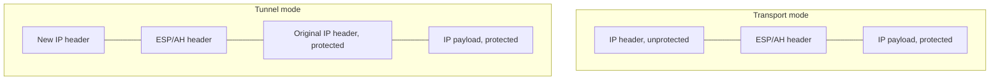

For example, two branch offices connect over the Internet through a site-to-site VPN: each office gateway applies ESP in tunnel mode, encapsulating and encrypting every packet between the offices, so internal hosts communicate without any IPSec software of their own. In the same company, two data center servers use ESP in transport mode for end-to-end protection of database replication traffic while keeping the original IP headers for routing.

### 10. Other Secure Network Protocols

Sections 5 through 9 covered the primary secure network protocols. Several other protocols protect services that still transmit data in cleartext by default.

#### **SMTPS and STARTTLS**

Simple mail transfer protocol (SMTP) sends email from a client to a mail server and between mail servers, and uses TCP port 25 in cleartext. SMTPS, also called SMTP over SSL, wraps SMTP in SSL/TLS from the start of the connection and uses TCP port 465. STARTTLS is an SMTP command that upgrades an existing cleartext connection on TCP port 25 or 587 to an encrypted TLS connection during the session. RFC 8314 recommends implicit TLS on port 465 for email submission. For example, when Alice sends the signed S/MIME message from Section 5, her email client submits the message to her mail provider over SMTPS on TCP 465, so the message stays protected on every hop that supports TLS.

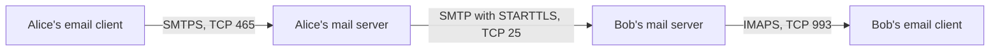

#### **DNS over TLS (DoT)**

DNS over TLS (DoT), defined in RFC 7858, encrypts DNS queries inside a TLS session over TCP port 853. DoT provides the same query confidentiality as DoH, but the dedicated port makes DoT traffic easy for a network administrator to identify and block, while DoH shares TCP 443 with web traffic and blends in. Android has supported DoT since Android 9 under the name Private DNS.

#### **Network Time Security (NTS)**

Network time protocol (NTP) synchronizes device clocks over UDP port 123 without authentication, so an attacker who spoofs NTP responses can shift a victim's clock and disrupt certificate validation and log correlation. Network Time Security (NTS), defined in RFC 8915, adds TLS-based authentication to NTP, so the client verifies the time server and detects modified time responses.

#### **Syslog over TLS**

Syslog sends log messages to a central collector over UDP port 514 in cleartext. Syslog over TLS, defined in RFC 5425, transmits log messages inside a TLS session over TCP port 6514, which protects log confidentiality in transit and prevents an on-path attacker from altering or injecting log entries.

The following table summarizes the secure protocols covered in this chapter and the default port of each protocol.

| Protocol | Protects | Default port |
| --- | --- | --- |
| POP3S | Email retrieval | TCP 995 |
| IMAPS | Email retrieval | TCP 993 |
| SMTPS and STARTTLS | Email sending | TCP 465, TCP 587 |
| SSH, SFTP, SCP | Remote access and file transfer | TCP 22 |
| FTPS | File transfer | TCP 989 and 990 |
| SRTP | Voice and video | UDP 5004 |
| LDAPS | Directory services | TCP 636 |
| HTTPS | Web traffic | TCP 443 |
| DoH | DNS queries | TCP 443, inside HTTPS |
| DoT | DNS queries | TCP 853 |
| SNMPv3 | Network management | UDP 161 and 162 |
| NTS | Time synchronization | UDP 123, with TLS |
| Syslog over TLS | Log transfer | TCP 6514 |
| IPSec | IP packets | Layer 3, no port |

## Summary

This chapter defined denial-of-service and distributed denial-of-service attacks, the three DDoS attack types (network-based, protocol-based, and application layer), the vulnerability of operational technology, the amplified and reflected DDoS methods, and the four mitigation techniques: rate limiting, black hole filtering, anycast distribution, and traffic scrubbing. The chapter described DNS, DNS zones, and domain reputation, then covered domain hijacking, URL redirection, DNS poisoning, and DNSSEC with data origin authentication and data integrity. The chapter examined the three data link layer attacks: ARP poisoning, MAC flooding with unicast flooding, and MAC cloning. The chapter compared the Layer 3 Man-In-The-Middle attack with the Layer 7 Man-In-The-Browser attack. The chapter then detailed the secure protocols: POP3S on TCP 995, IMAPS on TCP 993, S/MIME, SSH on TCP 22, FTPS on TCP 989 and 990, SFTP, SRTP on UDP 5004, LDAPS on TCP 636, HTTPS on TCP 443, DNS over HTTPS inside HTTPS on TCP 443, SNMPv3 with the NoAuthNoPriv, AuthNoPriv, and AuthPriv security levels, and IPSec with the AH and ESP protocols in transport and tunnel modes. The chapter closed with additional secure protocols: SMTPS and STARTTLS on TCP 465 and 587, DNS over TLS on TCP 853, Network Time Security for authenticated time synchronization, and syslog over TLS on TCP 6514.

## Useful References and Resources

- RFC 4033, "DNS Security Introduction and Requirements," the introduction to DNSSEC and the security problems the extensions address.
- RFC 8499, "DNS Terminology," the standard definitions of DNS zones, authoritative name servers, and resolution.
- RFC 8484, "DNS Queries over HTTPS (DoH)," the specification of DNS resolution inside HTTPS connections.
- RFC 826, "An Ethernet Address Resolution Protocol," the specification of ARP.
- RFC 1939, "Post Office Protocol - Version 3," and RFC 3501, "Internet Message Access Protocol - Version 4rev1," the specifications of POP3 and IMAP4.
- RFC 8551, "Secure/Multipurpose Internet Mail Extensions (S/MIME) Version 4.0 Message Specification," the current S/MIME message format standard.
- RFC 4253, "The Secure Shell (SSH) Transport Layer Protocol," covering SSH encryption, integrity, and public key authentication.
- RFC 4217, "Securing FTP with TLS," the specification of FTPS, and RFC 4251, "The Secure Shell (SSH) Protocol Architecture," the basis for SFTP.
- RFC 3711, "The Secure Real-time Transport Protocol (SRTP)," covering AES counter mode encryption, HMAC-SHA1 authentication, and replay protection.
- RFC 4513, "Lightweight Directory Access Protocol (LDAP): Authentication Methods and Security Mechanisms," covering LDAP security including LDAP over TLS.
- RFC 2818, "HTTP Over TLS," the specification of HTTPS.
- RFC 3414, "User-based Security Model (USM) for version 3 of the Simple Network Management Protocol (SNMPv3)," covering the SNMPv3 security levels.
- RFC 4301, "Security Architecture for the Internet Protocol," the IPSec architecture covering AH, ESP, and the transport and tunnel modes.
- RFC 8314, "Cleartext Considered Obsolete: Use of Transport Layer Security (TLS) for Email Submission and Access," covering SMTPS on TCP 465.
- RFC 7858, "Specification for DNS over Transport Layer Security (TLS)," the specification of DoT on TCP 853.
- RFC 8915, "Network Time Security for the Network Time Protocol," covering authenticated time synchronization.
- RFC 5425, "Transport Layer Security (TLS) Transport Mapping for Syslog," covering syslog over TLS on TCP 6514.
